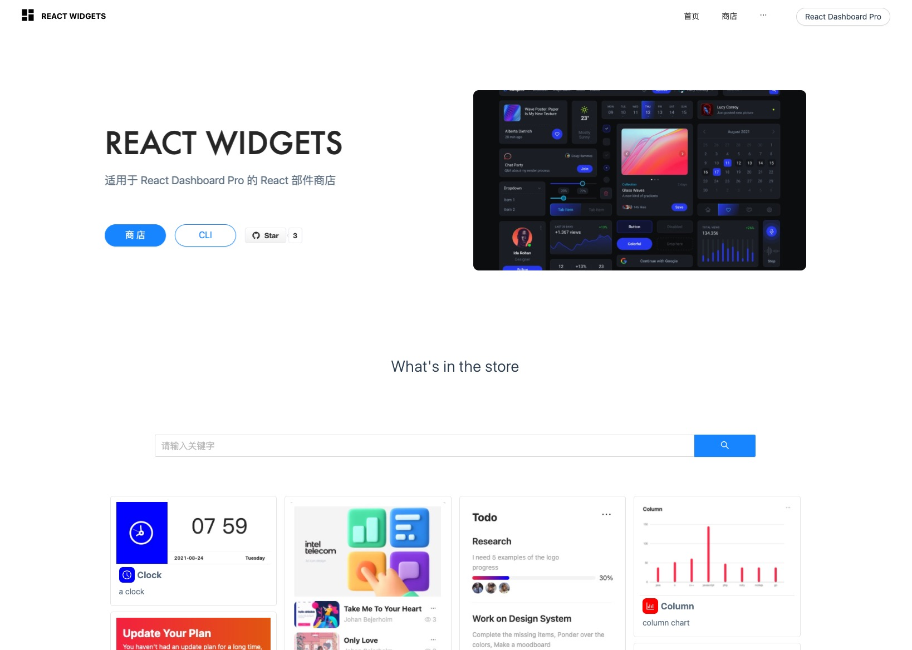

# react-widgets
React部件商店, 可在商店中选取所需的widget, 通过widgets-cli下载部件供给react-dashboard-pro使用

开发者可以在商店中选用各种所需的widget进行二次开发。

目前多数widget依赖了antd, 使用了ts、less、css module
## 部件商店
https://yuanguandong.github.io/react-widgets/


## React Dashboard Pro
需结合 [react-dashboard-pro](https://github.com/yuanguandong/react-dashboard-pro) 使用


## 参与共建
欢迎大家参与到widgets部件商店的建设中来 👏🏻

### 开发流程
```bash
# 拉取本仓库
git clone git@github.com:yuanguandong/react-widgets.git

# 进入项目目录
cd react-widgets

# 安装依赖
npm run install

# 新建widget
npm run create xxxx

# xxxx为新增的widget ID, 全小写命名

# 从统一入口widgets/index.tsx中导出
# import xxx from './xxx';
# export default {
#   // ……
#   xxx
# };

# 启动项目
npm run start

# 访问DEV PAGE
# localhost:8000#dev?id=xxxx

# 开发完成，提交PR到feature分支

# PR合并通过后会自动部署到部件商店
```

### 规范
请按如下规范编写导出widget

```ts
//interface
export interface WidgetIF {
  name: string;
  description: string;
  tags: string[];
  component: Component | FunctionComponent;
  configComponent: Component | FunctionComponent | null;
  maxLength: number;
  snapShot: ImageBitmapSource;
  icon: ReactElement;
  iconBackground: string;
  size: {
    defaultWidth: number;
    defaultHeight: number;
    maxWidth: number;
    maxHeight: number;
    minWidth: number;
    minHeight: number;
  };
  [key: string]: any;
}
```

### 示例
部件定义
```ts
// widgets/clock/index.tsx
import { ClockCircleOutlined } from '@ant-design/icons';
import Panel from './component';
import snapShot from './snapshot.png';
import type { WidgetIF } from 'react-dashboard-pro';

export default {
  name: 'Clock',
  description: 'a clock',
  tags: ['all', 'system'],
  component: Panel,
  configComponent: null,
  maxLength: 2,
  snapShot,
  icon: <ClockCircleOutlined />,
  iconBackground: 'blue',
  size: {
    defaultWidth: 4,
    defaultHeight: 5,
    maxWidth: 12,
    maxHeight: 16,
    minWidth: 2,
    minHeight: 4,
  },
  author: 'Favori',
} as WidgetIF;
```

在统一入口中导出
```ts
//widgets/index.tsx
// ...
import xxx from './xxx';
export default {
  // ……
  xxx
};
```

